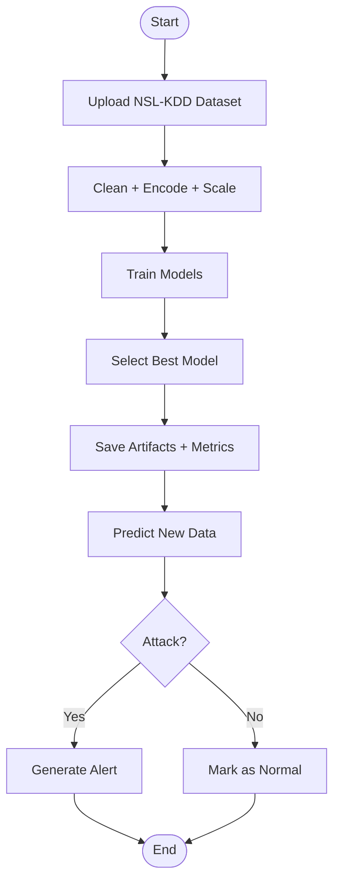

# Flowchart

```mermaid
flowchart TD
    Start([Start]) --> Upload[Upload NSL-KDD Dataset]
    Upload --> Preprocess[Clean + Encode + Scale]
    Preprocess --> Train[Train Models]
    Train --> Select[Select Best Model]
    Select --> Save[Save Artifacts + Metrics]
    Save --> Predict[Predict New Data]
    Predict --> Alert{Attack?}
    Alert -- Yes --> Notify[Generate Alert]
    Alert -- No --> Normal[Mark as Normal]
    Notify --> End([End])
    Normal --> End
```
